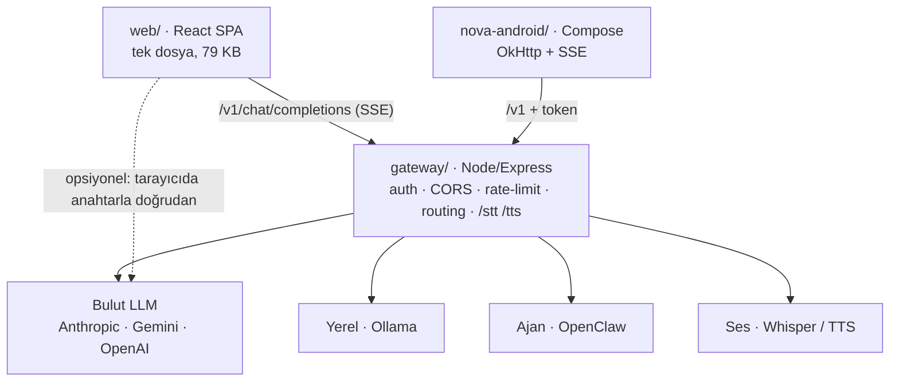
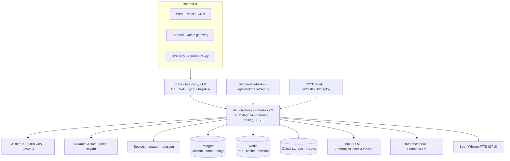

# NOVA Agent — Mimari İnceleme ve Production Yol Haritası

**Hazırlanma tarihi:** 9 Haziran 2026
**Kapsam:** Mevcut mimarinin gözden geçirilmesi, ayağa kaldırma adımları ve engeller, iyileştirmeler, ardından "herkese açık / çok kullanıcılı" hedefe uygun yeni mimari.
**Hedef:** İnternete açık, çok kullanıcılı production servisi.
**Öncelikler:** Ayağa kaldırma · güvenlik · ölçeklenebilirlik · kod kalitesi/bakım · yeni özellikler · maliyet kontrolü.

---

## 1. Yönetici özeti

NOVA, birçok LLM sağlayıcısını (Anthropic, Gemini, OpenAI, yerel Ollama, OpenClaw ajanı) tek bir OpenAI-uyumlu uç nokta arkasında toplayan, sade ve iyi düşünülmüş bir tasarım. İki istemci (React web + Kotlin/Compose Android) ince tutulmuş ve tüm sağlayıcı mantığı `gateway/gateway.mjs` içindeki tek dosyalık Node/Express sunucusunda. Gateway'i çalıştırıp test ettim: `/health`, `/v1/models` ve hata yönetimi (`ANTHROPIC_API_KEY not set` gibi) sorunsuz çalışıyor.

Tasarımın güçlü tarafı, bir *kişisel/yerel* araç olarak gerçekten olgun olması: sabit zamanlı token karşılaştırması, CORS allowlist, IP başına rate limit, body/mesaj limitleri, retry+backoff, timeout + istemci-abort, production'da yukarı-akış hata gizleme ve güvenlik başlıkları. Dokümantasyon da güçlü.

Ancak hedef "kişisel"den "herkese açık, çok kullanıcılı"ya kaydığında mimarinin temel varsayımları değişiyor. En kritik üç boşluk:

1. **Kimlik modeli tek paylaşılan token üzerine kurulu** (`GATEWAY_TOKEN`) ve varsayılanı *boş* — yani olduğu gibi internete açılırsa kimlik doğrulaması olmadan herkes senin sağlayıcı anahtarlarınla para harcayabilir. Çok kullanıcı için kullanıcı başına kimlik, kota ve faturalandırma gerekir.
2. **Sunucu tarafında kalıcılık yok** — sohbet geçmişi yalnızca tarayıcıda/cihazda. Çok kullanıcılı bir ürün genelde hesap + senkron geçmiş ister.
3. **Durum süreç-içi (in-memory)** — rate limit bir `Map`. Birden çok gateway örneği çalıştırınca her örneğin kendi sayacı olur; yatay ölçekleme bozulur.

Bunlara ek olarak: deploy artefaktı yok (Dockerfile/IaC yok), CI yok, web/gateway testi yok, gözlemlenebilirlik yok, Android `gradle-wrapper.jar` eksik ve web istemcisi sağlayıcı anahtarlarını tarayıcıda saklayıp doğrudan sağlayıcıya çağrı yapabiliyor.

Önerilen yaklaşım **kademeli evrim, baştan yazım değil**. OpenAI-uyumlu gateway çekirdeği doğru bahis — onu koruyup etrafına production katmanlarını ekliyoruz. Yol haritası üç faz: **Faz 0** (gönderilebilir hale getir: token zorla, Dockerize et, TLS, CI, web'i gateway-only'a kilitle), **Faz 1** (çok kullanıcı çekirdeği: Postgres + Redis, gerçek auth, kalıcı geçmiş, kullanım ölçümü + kota), **Faz 2** (ölçek + ürün: otomatik ölçekleme, object storage, ayrı ses servisleri, gözlemlenebilirlik, faturalandırma).

---

## 2. Mevcut mimari (as-is)

### 2.1 Bileşenler

| Bileşen | Teknoloji | Rol | Notlar |
|---|---|---|---|
| `web/` | Vite + React 18 | Tarayıcı UI | Tek bileşen `nova-agent.jsx` (~1.296 satır / 79 KB) |
| `nova-android/` | Kotlin + Jetpack Compose | Native istemci | OkHttp + SSE; **yalnız** gateway'e konuşur (anahtarlar sunucuda) |
| `gateway/` | Node 18+ / Express | Çok-LLM yönlendirici | Tek dosya `gateway.mjs` (~493 satır), bağımlılık: yalnız `express` + `cors` |

Veri akışı: istemci → `POST /v1/chat/completions` (OpenAI tarzı, SSE streaming) → gateway `<provider>/<model>` öneki ile yönlendirir → Anthropic / Gemini / OpenAI / Ollama / OpenClaw. Ses için `/stt` (Whisper) ve `/tts` proxy'lenir.



### 2.2 Neyi iyi yapıyor (korunmalı)

- **Tek soyutlama noktası.** Tüm sağlayıcı farkları gateway'de uniform OpenAI-SSE'ye normalize ediliyor (`relay`, `sseLine`, `normMsg`). İstemciler ince. Yeni sağlayıcı eklemek tek yerde.
- **Kişisel araç için olgun güvenlik.** `safeEqual` ile sabit-zamanlı token karşılaştırması (`gateway.mjs:102`), CORS allowlist (`:349`), IP başına sabit-pencere rate limit (`:371`), body/mesaj limitleri (`:360`, `:411`), retry+backoff (`upFetch :113`), timeout + `req.on("close")` abort (`:425-427`), production'da hata gizleme (`clientErr :110`), güvenlik başlıkları (`:340`).
- **Android anahtarları sunucuda tutuyor** — doğru karar; istemci yalnız gateway adresini ve token'ı bilir.
- **Sıfır-bağımlılık `.env` yükleyici** (`:34`) ve minimal bağımlılık yüzeyi (express + cors).
- **Dinamik yönlendirme** (`pickModel :149`): efor + bağlam uzunluğu + mevcut anahtarlara göre model seçimi; maliyet-bilincine yakın (uzun bağlamda geniş pencere, "fast"te ucuz/yerel).
- **Test edilebilir saf çekirdek**: Android'de `NovaClient.parseDelta` için JUnit testleri var.
- **Streaming her yerde**, çoklu-medya (görsel) desteği, `x-nova-route` ile şeffaf yönlendirme rozeti.

---

## 3. Projeyi nasıl ayağa kaldırırız (runbook)

### 3.1 Yerel geliştirme (bugün çalışıyor)

```bash
# Kök dizinde
npm run install:all                 # gateway + web bağımlılıkları

cd gateway && cp .env.example .env  # GATEWAY_TOKEN üret + en az bir sağlayıcı anahtarı (veya Ollama)
node -e "console.log(require('crypto').randomBytes(32).toString('hex'))"   # token üretici
cd ..

npm run gateway                     # → http://localhost:8088/v1   (terminal A)
npm run web                         # → http://localhost:5173        (terminal B)
```

UI'da ⚙️ → **Gateway** sağlayıcısını seç, base URL `http://localhost:8088/v1`, token'ı yapıştır, model `auto`.

**Android:** `nova-android/` klasörünü Android Studio ile aç (eksik wrapper jar'ı Studio üretir). ⚙️ → Base URL `http://10.0.2.2:8088/v1` (emülatör), token. Run.

### 3.2 İlk internet deploy'u (kapalı beta seviyesi — production değil)

Gateway'i Caddy (otomatik TLS) arkasına al, `web/dist`'i aynı domainden servis et:

```caddyfile
# Caddyfile
nova.example.com {
    encode gzip
    handle /v1/* { reverse_proxy 127.0.0.1:8088 }
    handle /stt  { reverse_proxy 127.0.0.1:8088 }
    handle /tts  { reverse_proxy 127.0.0.1:8088 }
    handle      { root * /srv/nova/web/dist; try_files {path} /index.html; file_server }
}
```

`gateway/.env` (production ayarları):

```bash
GATEWAY_TOKEN=<güçlü-rastgele>
ALLOW_ORIGINS=https://nova.example.com      # asla "*" değil
NODE_ENV=production
TRUST_PROXY=1                                # yalnız güvenilir proxy arkasında
ALLOW_MODELS=anthropic/*,gemini/gemini-2.5-flash   # maliyet/exposure kontrolü
ANTHROPIC_API_KEY=...                        # vb.
```

> ⚠️ Bu kurulum **tek paylaşılan token** modelidir: kapalı bir beta için uygun, fakat birbirinden bağımsız "çok kullanıcı" için **yeterli değil** (kullanıcı bazında iptal/atıf/fatura yok). Çok kullanıcı için Bölüm 6–7'deki mimariye geç.

---

## 4. Engeller (blockers) — açıkça listelenmiş

Kodda doğruladığım, production/çok-kullanıcı hedefini engelleyen maddeler:

1. **`GATEWAY_TOKEN` varsayılanı boş = açık gateway** (`gateway.mjs:80`, `:386-391`; başlangıçta uyarı basıyor `:491`). Olduğu gibi açılırsa kimlik doğrulamasız.
2. **Android `gradle-wrapper.jar` eksik** — zip'te yalnız `gradle-wrapper.properties` var. `./gradlew` CLI/CI'da çalışmaz; Studio veya `gradle wrapper` gerekir. CI build'i için engel.
3. **Deploy artefaktı yok** — Dockerfile, docker-compose, systemd unit veya IaC yok. Süreç sadece `node gateway.mjs`. Güvenilir/tekrarlanabilir deploy için engel.
4. **TLS uygulamada yok** — ters proxy'ye bağımlı; Android `AndroidManifest.xml`'de `usesCleartextTraffic="true"` — production'da kaldırılıp `https` zorunlu olmalı.
5. **Tek paylaşılan token ≠ çok kullanıcı** — bir kullanıcıyı iptal etmek, kullanımını atfetmek veya kullanıcı başına faturalamak imkânsız.
6. **Sunucu-tarafı kalıcılık yok** — sohbet yalnız tarayıcı `window.storage`/Android DataStore'da. Hesap + senkron geçmiş yok.
7. **In-memory rate limit** (`hits` Map, `:363`) — çok örnekli/yatay ölçekte her örnek ayrı sayar; tutarsız ve adil değil.
8. **Test ve CI yok** — web ve gateway'de hiç test yok; yalnız tek Android birim testi var. `.github` yok.
9. **Gözlemlenebilirlik yok** — yalnız `console.log`. Yapısal log, metrik, trace, istek-ID, hata izleme yok.
10. **Bulut-dışı varsayılanlar localhost** — OpenClaw / Whisper / TTS varsayılan `localhost`; bulut deploy'da var olmazlar, gerçek servis verilmeli veya devre dışı bırakılmalı.
11. **Web tarayıcıda anahtar saklayıp doğrudan sağlayıcıya çağrı yapabiliyor** (`nova-agent.jsx:385` `anthropic-dangerous-direct-browser-access: true`; anahtar `window.storage`'da). Hosted üründe kapatılmalı.
12. **CSP wildcard riski giderildi** — UI artık local/gateway ve bilinen provider hostlarıyla sınırlı gelir. Custom host gerekiyorsa bilinçli olarak CSP allowlist'e eklenmeli.
13. **LICENSE eklendi** — MIT lisansı repo kökünde mevcut.

---

## 5. Boşluk analizi (kategori bazında)

### 5.1 Güvenlik

- **Kimlik & yetki:** Tek bearer token → gerçek authN'e geç (OIDC/JWT veya kullanıcı başına API key) + authZ (rol/kapsam). Anahtarları bir secrets manager'da tut, rotasyon uygula. "Kim neyi çağırdı" audit log'u ekle.
- **Rate limit kullanıcı bazında olmalı**, yalnız IP değil — IP NAT/proxy arkasında haksız ve kolay atlatılır.
- **SSRF yüzeyi:** Gateway yapılandırılmış yukarı-akışlara fetch yapıyor (kullanıcı URL'i değil — iyi). Ama web "özel base URL" + doğrudan-sağlayıcı modu tarayıcıyı her yere yönlendirebiliyor; hosted modda kilitle.
- **CSP'yi daralt:** `connect-src` yalnız gateway origin'ine.

### 5.2 Ölçeklenebilirlik

- **Durumu dışsallaştır:** rate limit + session + cache Redis'e. Böylece gateway *stateless* olur ve LB arkasında N örneğe ölçeklenir (SSE, doğru timeout'larla LB üzerinden sorunsuz çalışır; sticky gerekmez).
- **Pahalı işler için kuyruk:** uzun transkripsiyon/batch işleri BullMQ (Redis) veya SQS'e; gateway'i bloke etme.
- **Yerel model havuzu:** tek Ollama yerine kendi LB'si arkasında Ollama/vLLM havuzu; ses için GPU'lu ayrı Whisper/TTS servisleri.
- **Model listesi tek kaynak:** şu an model listeleri 3 yerde sabit (`gateway /v1/models`, web `MODELS`, android `MODELS`) → drift. Gateway capability'leri sunsun, istemciler çeksin.

### 5.3 Kod kalitesi / bakım

- **Web tek 1.296 satırlık bileşen** → bileşenlere, hook'lara ve sağlayıcı adaptörlerine ayır; durum yönetimini düzenle.
- **Sağlayıcı mantığı iki kez yazılmış** — gateway `viaX` ve web `streamChat` aynı işi yapıyor → drift riski. Hosted modda tarayıcı **her zaman** gateway'den geçsin; tarayıcı-doğrudan modu (ve tarayıcıda anahtar) kaldır → hem güvenlik hem bakım kazancı.
- **TypeScript yok** — büyük UI ve çok-şekilli gateway için tip güvenliği ve paylaşılan şema değerli.
- **İstek doğrulaması elle** — zod/JSON-schema ile şemalaştır.
- **Gateway tek dosya** — şimdilik iyi; sağlayıcı/özellik arttıkça `providers/`, `middleware/`, `routes/` olarak böl.
- **Sabit model ID'leri** (`claude-sonnet-4-20250514` gibi) eskiyecek; merkezi ve yapılandırılabilir yap.
- **Monorepo'yu koru**, workspaces ekle; gateway↔web arasında tipleri paylaş.

### 5.4 Maliyet kontrolü (öncelikli)

- Bugün token sahibi olan herkes sınırsız sağlayıcı $ harcayabilir.
- Gereken: **kullanıcı/org başına kota ve bütçe**, kullanım ölçümü (prompt/completion token → $), model allowlist (tier bazında), sert harcama tavanı, eşik alarmı.
- `auto` yönlendirme maliyet-bilincine yakın ama **sert bütçe zorlaması yok** — metering katmanı ekle (sağlayıcı `usage` alanlarını oku, kaydet, kotayı zorla).

### 5.5 Gözlemlenebilirlik

- Yapısal log (pino) + istek-ID uçtan uca; metrik (Prometheus/OpenTelemetry) → Grafana; trace; hata izleme (Sentry). Bir production servisi körlemesine çalıştırılamaz.

---

## 6. Hedef mimari (to-be)

OpenAI-uyumlu gateway çekirdeği korunur; etrafına production katmanları eklenir. Gateway *stateless* hale gelir, durum dışsallaşır.



### 6.1 Yeni bileşenler

- **Edge / ters proxy:** Caddy veya bulut LB — TLS, HTTP/2, gzip, güvenlik başlıkları, hafif WAF. Web için CDN.
- **Auth servisi / IdP:** OIDC sağlayıcı (Keycloak self-host veya Clerk/Auth0) JWT verir; gateway JWKS ile doğrular; kullanıcı kimliği eşlenir. Programatik erişim için kullanıcı başına API key.
- **Postgres:** kullanıcı, org, sohbet, mesaj, API key, kullanım kaydı, kota, sağlayıcı yapılandırması.
- **Redis:** dağıtık rate limit, session, model-listesi/yanıt cache.
- **Object storage (S3-uyumlu):** görsel/ses blob'ları (25 MB base64'ü JSON'da taşımak yerine).
- **Kullanım & faturalandırma:** istek başına token ölç, bütçeyi zorla, isteğe bağlı Stripe metered.
- **Secrets manager:** sağlayıcı anahtarları (Vault/bulut secrets) + rotasyon.
- **Gözlemlenebilirlik:** pino → log toplama; OpenTelemetry/Prometheus → Grafana; Sentry.
- **CI/CD + IaC:** GitHub Actions (lint, typecheck, test, build, container, deploy) + Terraform. Orkestrasyon: K8s veya daha sade PaaS (Fly.io/Render/ECS).

### 6.2 Veri modeli taslağı (Postgres)

```sql
users(id, email, name, created_at)
orgs(id, name)               memberships(user_id, org_id, role)
api_keys(id, user_id, hash, prefix, scopes, created_at, revoked_at)
conversations(id, user_id, title, created_at, updated_at)
messages(id, conversation_id, role, content, model, route,
         tokens_in, tokens_out, created_at)
usage(id, user_id, model, tokens_in, tokens_out, cost_cents, ts)
quotas(subject_id, period, limit_cents, used_cents)        -- user veya org
provider_configs(provider, key_ref, enabled, allow_models)
```

### 6.3 İstek akışı (hedef)

İstemci → IdP login → JWT → gateway JWKS ile doğrular → kullanıcıya eşler → **kotayı kontrol et** → yönlendir → stream → **kullanımı ölç ve kaydet** → mesajı kalıcılaştır.

---

## 7. Faz faz yol haritası

### Faz 0 — Gönderilebilir hale getir (≈1–2 hafta)
*Öncelik: ayağa kaldırmak + acil güvenlik.*

- `GATEWAY_TOKEN` zorunlu yap (boşsa production'da başlamayı reddet).
- Gateway için **Dockerfile** + **docker-compose** (gateway + Caddy). `web/dist`'i Caddy ile TLS arkasında servis et.
- Android: `usesCleartextTraffic` kaldır → `https`; eksik `gradle-wrapper.jar`'ı ekle (CI build'i için).
- Web'i **gateway-only**'a kilitle: tarayıcı-doğrudan sağlayıcı modunu ve tarayıcıda anahtar saklamayı kaldır; CSP `connect-src`'i daralt.
- Yapısal log (pino) + istek-ID + `/metrics`; temel CI (lint/test/build).
- Sonuç: tek-token kapalı beta güvenle yayında.

### Faz 1 — Çok kullanıcı çekirdeği (≈3–5 hafta)
*Öncelik: çok kullanıcı, güvenlik, maliyet.*

- **Postgres + Redis** ekle. Rate limit'i Redis'e taşı (stateless gateway).
- **Gerçek auth:** OIDC/JWT + kullanıcı başına API key; per-user yetki ve rate limit.
- **Kalıcı sohbet** + cihazlar arası senkron geçmiş.
- **Kullanım ölçümü + kullanıcı/org kotaları** (maliyet kontrolü): token→$, sert tavan, alarm.
- Web'i bileşen/adaptörlere ayır; TypeScript'i kademeli getir; web+gateway testleri ekle.

### Faz 2 — Ölçek + ürün (sürekli)
*Öncelik: ölçeklenebilirlik, yeni özellikler.*

- Yatay otomatik ölçekleme; medya için object storage; ayrı GPU'lu ses servisleri + kuyruk.
- Gözlemlenebilirlik yığını (Prometheus/Grafana/Sentry/OTel) tam kurulum.
- Admin UI (sağlayıcı anahtarı/model kataloğu yönetimi); org/çok-kiracılı destek.
- Faturalandırma (Stripe metered); tool-calling/function-calling passthrough.

---

## 8. Trade-off analizi

| Karar | Seçenekler | Öneri | Gerekçe |
|---|---|---|---|
| Auth | Self-host (Keycloak) vs SaaS (Clerk/Auth0) | Beta'da SaaS, ölçekte yeniden değerlendir | Hız vs kontrol/maliyet; standart OIDC sayesinde sonradan taşınabilir |
| Orkestrasyon | K8s vs PaaS (Fly/Render/ECS) | PaaS ile başla | K8s erken aşamada gereksiz operasyon yükü |
| Transport | SSE vs WebSocket | SSE kal | Mevcut, basit, LB-dostu; tek-yönlü stream için yeterli |
| Web | Baştan yaz vs kademeli ayrıştır | Kademeli | Çalışan UI'yi atma; risk düşür |
| Veritabanı | Postgres vs serverless DB | Postgres | İlişkisel model (usage/kota) net oturur; ekosistem olgun |
| Dil | JS kal vs TypeScript | TS'e kademeli geç | Paylaşılan tipler drift'i ve hataları azaltır |

---

## 9. Somut başlangıç parçacıkları

**Gateway Dockerfile:**
```dockerfile
FROM node:22-alpine
WORKDIR /app
COPY gateway/package*.json ./
RUN npm ci --omit=dev
COPY gateway/ .
ENV NODE_ENV=production
EXPOSE 8088
CMD ["node", "gateway.mjs"]
```

**Production'da boş token'ı reddet** (gateway.mjs başına):
```js
if (process.env.NODE_ENV === "production" && !process.env.GATEWAY_TOKEN) {
  console.error("FATAL: production'da GATEWAY_TOKEN zorunlu."); process.exit(1);
}
```

**Dağıtık rate limit (Redis, stateless gateway):**
```js
// fixed-window, atomik INCR + EXPIRE
const k = `rl:${userId}:${Math.floor(Date.now()/RATE_WINDOW_MS)}`;
const n = await redis.incr(k);
if (n === 1) await redis.pexpire(k, RATE_WINDOW_MS);
if (n > RATE_MAX) return res.status(429).json({ error: "rate limit exceeded" });
```

**JWT doğrulama middleware (taslak):**
```js
import { createRemoteJWKSet, jwtVerify } from "jose";
const JWKS = createRemoteJWKSet(new URL(process.env.OIDC_JWKS_URL));
app.use(async (req, res, next) => {
  if (req.path === "/health") return next();
  try {
    const t = (req.headers.authorization || "").replace(/^Bearer /, "");
    const { payload } = await jwtVerify(t, JWKS, { issuer: process.env.OIDC_ISSUER });
    req.user = { id: payload.sub, email: payload.email };
    next();
  } catch { res.status(401).json({ error: "unauthorized" }); }
});
```

**CI iskeleti (.github/workflows/ci.yml):**
```yaml
on: [push, pull_request]
jobs:
  build:
    runs-on: ubuntu-latest
    steps:
      - uses: actions/checkout@v4
      - uses: actions/setup-node@v4
        with: { node-version: 22 }
      - run: npm run install:all
      - run: npm --prefix web run build
      # ileride: npm test (gateway + web), lint, typecheck
```

---

## 10. Büyüdükçe yeniden gözden geçirilecekler

- **Fixed-window rate limit → sliding-window / token-bucket** (pencere sınırında ani yük adil değil).
- **Tek bölge → çok bölge** (gecikme + dayanıklılık); Postgres read-replica.
- **Yanıt cache'i** (aynı prompt + deterministik ayarlar) maliyeti düşürür.
- **Sağlayıcı failover/circuit breaker** — bir sağlayıcı 5xx verdiğinde otomatik alternatif.
- **Mesaj içeriği şifreleme (at-rest)** ve veri saklama/silme politikası (KVKK/GDPR).
- **Prompt-injection ve içerik güvenliği** katmanı (özellikle ajan/tool-calling yolu açılınca).

---

*Bu rapor `gateway/gateway.mjs`, `web/src/nova-agent.jsx`, `nova-android/` kaynakları ve gateway'in canlı çalıştırılarak (`/health`, `/v1/models`, hata yolu) doğrulanması temel alınarak hazırlanmıştır.*
